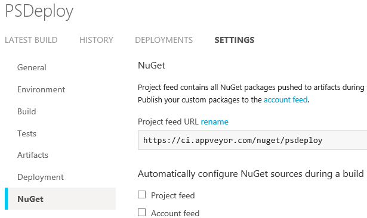

This example illustrates using the AppVeyorModule deployment to publish a module directly to AppVeyor.

Here's the deployment config, My.PSDeploy.ps1:

```PowerShell
Deploy DeveloperBuild {
    By AppVeyorModule {
        FromSource MyModuleNameHere
        To AppVeyor
    }
}
```

In this example, we deploy both a zip file and a NuGet package to our AppVeyor build.

This idea was borrowed from the PowerShell team's use of AppVeyor to distribute [development builds](https://github.com/PowerShell/DscResources#development-builds) for DSC resources.

## Real Example

Here's a quick example from PSDeploy itself:

```PowerShell
# Publish to AppVeyor if we're in AppVeyor
if(
    $env:BHProjectName -and $ENV:BHProjectName.Count -eq 1 -and
    $env:BHBuildSystem -eq 'AppVeyor'
   )
{
    Deploy DeveloperBuild {
        By AppVeyorModule {
            FromSource $ENV:BHProjectName
            To AppVeyor
            WithOptions @{
                Version = $env:APPVEYOR_BUILD_VERSION
            }
        }
    }
}
```

The $ENV:BH* variables are created via [BuildHelpers](https://github.com/RamblingCookieMonster/BuildHelpers).

Here are the resulting artifacts in the build:

[](images/appveyormodule.png)

Note that by default, your project's NuGet feed may have some random characters to add uniqueness.  To view or configure this URL in AppVeyor, browse to your project settings, NuGet tab:

[](images/appveyornuget.png)

Now that I know the URL, I'm ready to register and use this feed:

```PowerShell
Register-PSRepository -Name PSDeploy -SourceLocation https://ci.appveyor.com/nuget/psdeploy

Find-Module -Repository PSDeploy

# Version Name     Type   Repository Description
# ------- ----     ----   ---------- -----------
# 1.0.146 psdeploy Module PSDeploy   psdeploy
```