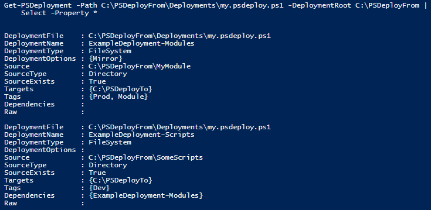
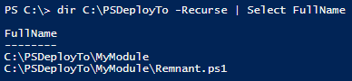
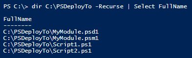

This section will illustrate a simple deployment via a *.psdeploy.ps1 file.  These are more flexible than yaml deployments, given that you can include inline PowerShell code.

This might look convoluted, but most of the code is creating some test data for you to deploy. All you need to do in reality is set up a *.PSDeploy.ps1 file, and Invoke-PSDeploy.

### Stage Things

Let's set up a few folders and files that we will use in our PSDeploy example:

```powershell

# Source folders and files

    mkdir C:\PSDeployFrom
    mkdir C:\PSDeployFrom\MyModule
    mkdir C:\PSDeployFrom\SomeScripts
    mkdir C:\PSDeployFrom\Deployments
    New-Item -ItemType File -Path C:\PSDeployFrom\MyModule\MyModule.psm1
    New-Item -ItemType File -Path C:\PSDeployFrom\MyModule\MyModule.psd1
    New-Item -ItemType File -Path C:\PSDeployFrom\SomeScripts\Script1.ps1
    New-Item -ItemType File -Path C:\PSDeployFrom\SomeScripts\Script2.ps1

# Target folder, with a file that mirror should overwrite

    mkdir C:\PSDeployTo
    mkdir C:\PSDeployTo\MyModule
    New-Item -ItemType File -Path C:\PSDeployTo\MyModule\Remnant.ps1

# Sample PSDeploy.ps1 file

Set-Content C:\PSDeployFrom\Deployments\my.psdeploy.ps1 -Value @'

Deploy ExampleDeployment {

    By FileSystem Scripts {

        FromSource 'SomeScripts'
        To 'C:\PSDeployTo'
        Tagged Dev
        DependingOn ExampleDeployment-Modules
    }

    By FileSystem Modules {

        FromSource MyModule
        To C:\PSDeployTo
        Tagged Prod, Module
        WithOptions @{
            Mirror = $true
        }
    }
}
'@
```

### Read the PSDeploy.ps1

That's it! We have some source folders and files, and a psdeploy.ps1 describing where they should be deployed. Let's look at this file:

```powershell
Deploy ExampleDeployment {

    By FileSystem Scripts {

        FromSource 'SomeScripts'
        To 'C:\PSDeployTo'
        Tagged Dev
        DependingOn ExampleDeployment-Modules
    }

    By FileSystem Modules {

        FromSource MyModule
        To C:\PSDeployTo
        Tagged Prod, Module
        WithOptions @{
            Mirror = $true
        }
    }
}
```

So! What does this actually translate to?

```powershell
# Get the deployment details
# We use relative paths, so we specify a DeploymentRoot
Get-PSDeployment -Path C:\PSDeployFrom\Deployments\my.psdeploy.ps1 -DeploymentRoot C:\PSDeployFrom |
    Select -Property *
```

[](images/QuickStart-Get-PSD.png)

Looks good to me. Notice that the order takes into account the dependency (DependingOn) we listed.

### Invoke a Deployment

We're ready to deploy!

Let's view the contents of C:\PSDeployTo, invoke a deployment, and see what happened.

Before:

[](images/QuickStart.BeforeInvoke.png)

```powershell
# Browse to the deployment root
cd C:\PSDeployFrom

# Invoke a deployment!
Invoke-PSDeploy
```

After:

[](images/QuickStart.AfterInvoke.png)

The module deployment 'mirror' removed the Remnant.ps1 file, and all the files we expect have been deployed!

### Cleanup

That's about it! Let's clean up those folders.

```powershell
Remove-Item -Recurse -force -Confirm:$False -Path C:\PSDeployTo
Remove-Item -Recurse -force -Confirm:$False -Path C:\PSDeployFrom
```