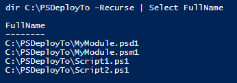

This is a quick example showing a Filesystem deployment:

Here's the deployment config, My.PSDeploy.ps1:

```PowerShell
Deploy ExampleDeployment {

    By FileSystem Scripts {
        FromSource 'SomeScripts'
        To 'C:\PSDeployTo'
        Tagged Dev
        DependingOn ExampleDeployment-Modules
    }

    By FileSystem Modules {
        FromSource MyModule
        To C:\PSDeployTo
        Tagged Prod, Module
        WithOptions @{
            Mirror = $true
        }
    }
}
```

Here are the source files:

[](images/DirFrom.png)

We run `Invoke-PSDeploy` from C:\PSDeployFrom, and deployments run as expected:

[](images/DirTo.png)