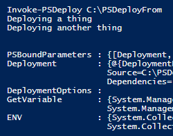
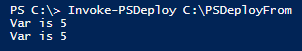

Task DeploymentTypes allow you to specify an arbitrary PowerShell script (a task) as a deployment.  These are a quick and dirty way to run PowerShell code instead of a DeploymentType script, while allowing you to specify these 'Tasks' as a dependency.

Here's a simple illustration:

```powershell
Deploy Example {
    By Noop {
        FromSource MyModule
        To C:\PSDeployTo
        DependingOn Example-One, Example-Two
    }
    By Task One {
        "Deploying a thing"
    }
    By Task Two {
        "Deploying another thing"
    }
}
```

[](images/task.png)

Notice that the Task deployment is simply a scriptblock with code you define.

Two important notes here:

* These are deployments.  They run once.  If you set multiple deployments to depend on one task, it *does not* mean that the task will run before each deployment.  DependingOn is only used for ordering.  See [setup and teardown scripts](Feature.-Setup-and-Teardown-Scripts.md) for re-usable scripts to run before or after multiple deployments.

* You can't use DependingOn or other PSDeploy functions within a Task.  The reason is that the Task itself is the deployment... meaning that if we wanted to just read (get) a deployment, we would actually run it.

### A Tangent On In-line PowerShell

You might ask... why can't I just run PowerShell in-line?  The answer is that you absolutely can, but it will run when PSDeploy is parsing the PS1 file.  This means read opertions will run at Get-PSDeployment time, not at deploy time. Here's an example illustrating the outcome:

```powershell
Deploy Example {

    $Script:Var = 1 # In-line code

    By Task One {
        "Var is $Script:Var"
    }
    $Script:Var = 5
    By Task Two {
        "Var is $Script:Var"
    }
}
```

[](images/ripe.for.injection.png)

If you want to use PowerShell, you can always call code ahead of the deployment outside of the Deploy function, keeping in mind that it will run before any deployments, and will run when you call Get-PSDeployment:

```powershell
$env:Var = 2

Deploy Example {
    By Task One {
        "Var is $env:Var"
    }
    By Task Two {
        "Var is $env:Var"
    }
}
```

[](images/env.var.png)

To restrict code to running at deployment rather than Get-PSDeployment, use the Task DeploymentType, or [setup and teardown scripts](Feature.-Setup-and-Teardown-Scripts.md).