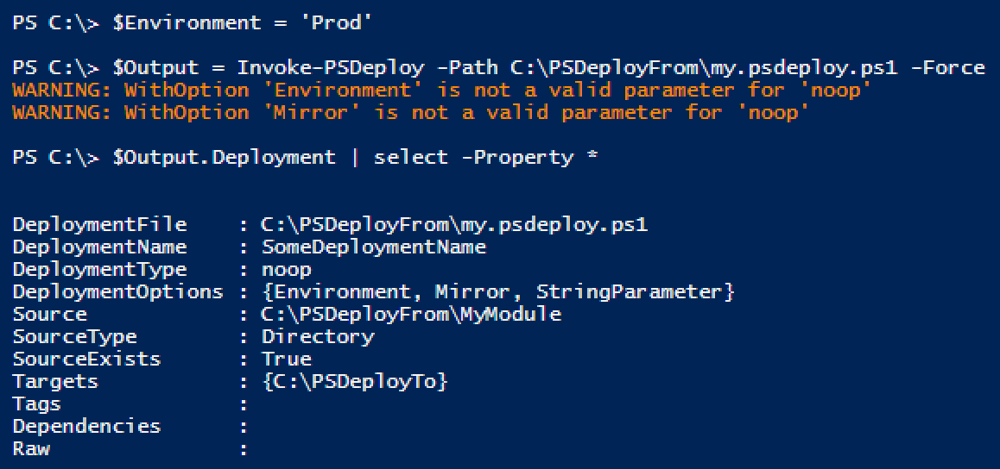
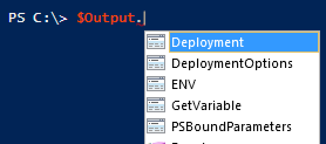

PSDeploy is somewhat extensible. There are two quick steps to add your own deployment:

* Update PSDeploy.yml to tell PSDeploy about your new DeploymentType, and the script that it uses
* Create the script that your DeploymentType runs

## Updating PSDeploy.yml

PSDeploy.yml can be found in the root of the PSDeploy module folder. Edit this to add a new DeploymentType.

  * The DeploymentType name is the root node
  * The script node defines what script to run for these deployment types (This looks in PSDeploy\PSDeployScripts\)
  * The description is displayed for users when they run Get-PSDeploymentType

For example, I might add support for SCP:

```yaml
SCP:
  Script: SCP.ps1
  Description: Deploys artifacts using SCP. Requires Posh-SSH
```

## Writing a Deployment Script

Now that PSDeploy knows the name of your DeploymentType, and the path to a script it will run, we need to actually write the script!

* Create the associated script in PSDeploy\PSDeployScripts
  * Include a 'Deployment' parameter.
  * Include other parameters as needed. Users can hit these parameters using WithOptions, which splats valid parameters against your deployment script

Continuing with the SCP example, I would create \\Path\To\PSDeploy\PSDeployScripts\SCP.ps1

Here's how you might use the Deployment parameter:

```powershell
param(
    [ValidateScript({ $_.PSObject.TypeNames[0] -eq 'PSDeploy.Deployment' })]
    [psobject[]]$Deployment
    #... other params
)

foreach($Deploy in $Deployment)
{
    Do-SomethingWith $Deploy.DeploymentName
    Do-SomethingElseWith $Deploy.Source
    foreach($Target in $Deploy.Targets)
    {
        Deliver-SomethingTo $Target -From $Deploy.Source
    }
}
```

If you need to pass through your parameters to another function, you can simply remove the Deployment key from PSBoundParameters and splat as needed:

```
# $Deployment would still be available, just not listed in bound params.
$PSBoundParameters.Remove('Deployment')
```

See [PSDeployScripts](https://github.com/RamblingCookieMonster/PSDeploy/blob/master/PSDeploy/PSDeployScripts) for several examples

## Viewing the Environment State in a DeploymentScript

You can absolutely write your own debug or verbose output to handle this, but if you want a quick and dirty view into the environment of a DeploymentScript, you can invoke a deployment using the noop DeploymentType.  This simply spits back the deployments, bound parameters, session variables, and environment variables seen within the deployment script.

Here's a quick example:

```powershell
Deploy SomeDeploymentName {
    By noop {
        if($Explorer = Get-Item C:\Windows\explorer.exe)
        {
            FromSource MyModule
            To C:\PSDeployTo
            WithOptions @{
                Mirror = $True
                Environment = $Environment
                StringParameter = $Explorer
            }
        }
    }
}
```

Let's invoke this and explore:

[](images/noop1.png)

You'll notice some warnings.  When using WithOptions, PSDeploy attempts to [splat](https://ramblingcookiemonster.wordpress.com/2014/12/01/powershell-splatting-build-parameters-dynamically/) the provided hash table against the deployment script, leaving out keys that aren't actually parameters.  Of the three WithOptions we provided, only StringParameter is a parameter that our DeploymentScript Noop.ps1 accepts, so we see warnings for the two others.  These are still accessible in the deployment script through the Deployment's DeploymentOptions:

[](images/noop2.png)

Another interesting thing to note is that you have access to any variables in the PowerShell session.  We defined $Environment outside of PSDeploy, used it in our PSDeploy.ps1, and the value is used by the deployment script without issue.  Take care with this, but keep in mind it will generally work.

Feel free to explore the rest of the output from the noop deployment:

[](images/noop3.png)

## Testing

The testing is currently in a monolithic tests file. This will eventually be broken out. Ideally we'll have tests for each DeploymentType.

At the very least, please bump the count for Get-PSDeploymentType and Get-PSDeploymentScript tests for It "Should get definitions"