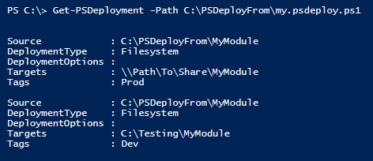
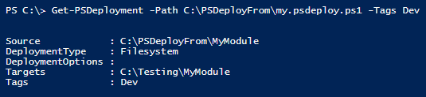

Tags allow you to deploy (or get) only specifically tagged deployments.  This can help in a variety of scenarios. For example:

* Perhaps you only want to deploy items tagged 'Prod' or 'Dev'
* Perhaps you want to only deploy items tagged 'Azure' or 'AzureStack'

Two functions allow you to filter on tags:

* Invoke-PSDeploy
* Get-PSDeployment

Let's look at an example of each.  We'll use the following psdeploy.ps1 file to illustrate:

```powershell
Deploy MyModule {
    By Filesystem {
        FromSource MyModule
        To \\Path\To\Share\MyModule
        Tagged Prod
    }

    By Filesystem {
        FromSource $SourceShare\Dev\MyModule
        To C:\Testing\MyModule
        Tagged Dev
    }
}
```

Here's what you get without filtering tags:

```powershell
Get-PSDeployment -Path C:\PSDeployFrom\my.psdeploy.ps1
```

](images/feature.tag.all.png)

Maybe we only want to look at Dev deployments:

```powershell
Get-PSDeployment -Path C:\PSDeployFrom\my.psdeploy.ps1 -Tags Dev
```
](images/feature.tag.dev.png)

Finally, we can filter out deployments using this tag:

```powershell
Invoke-PSDeploy -Tags Dev
```